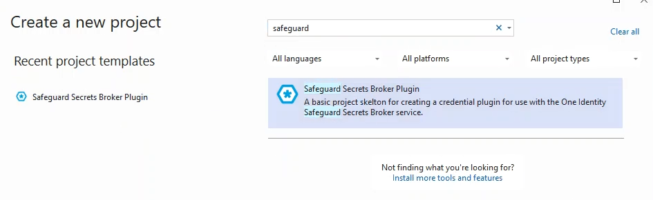

# Safeguard Secrets Broker for DevOps Plugin Project Template
Download the included Zip file and place it in your Visual Studio User Project Template directory under a new folder. Then restart Visual Studio.

Watch the following video for a complete example.
[Project Template Video](../Images/safeguardSecretsBrokerPluginProjectTemplate.mp4)

If you want to make changes to the project template, just do so manually, then zip up the files.