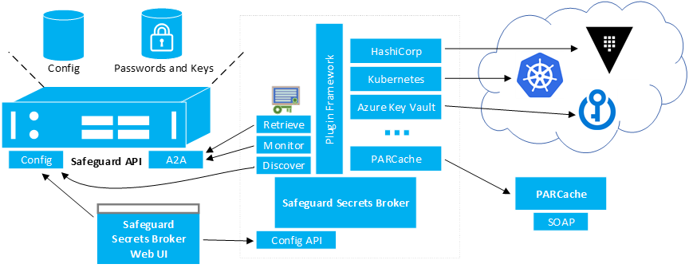
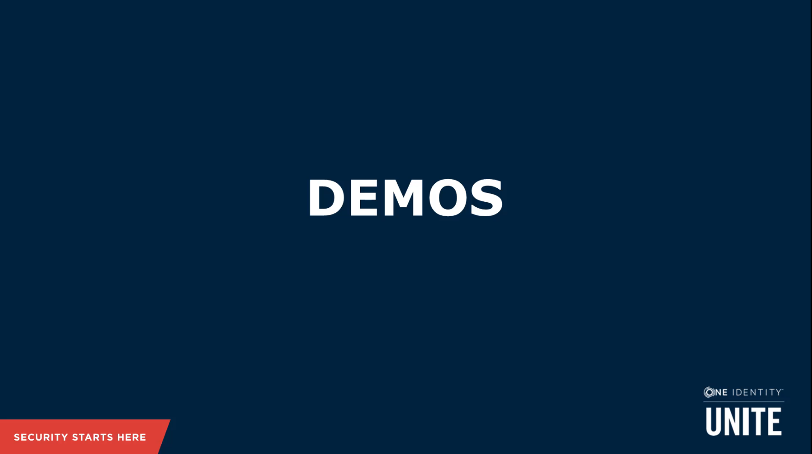

[](https://github.com/OneIdentity/SafeguardDevOpsService/releases/)
[](https://hub.docker.com/r/oneidentity/safeguard-devops/)
[](https://github.com/OneIdentity/SafeguardDevOpsService/blob/master/LICENSE)

# Safeguard Secrets Broker for DevOps

The term DevOps can mean different things to different people.  It is important to make sure that we understand what we mean when we say we need help securing DevOps.

DevOps is any form of automation used between software development teams and operations teams to build, test, and release software with speed and resilience.  Most often, people think of DevOps in the context of automating the deployment of a SaaS solution to a cloud environment. However, DevOps can also be as simple as a source code repository hook that triggers a build server to check out and build a .NET library and push it to a NuGet server.

## Support

One Identity open source projects are supported through [One Identity GitHub issues](https://github.com/OneIdentity/SafeguardDevOpsService/issues) and the [One Identity Community](https://www.oneidentity.com/community/). This includes all scripts, plugins, SDKs, modules, code snippets or other solutions. For assistance with any One Identity GitHub project, please raise a new Issue on the [One Identity GitHub project](https://github.com/OneIdentity/SafeguardDevOpsService/issues) page. You may also visit the [One Identity Community](https://www.oneidentity.com/community/) to ask questions.  Requests for assistance made through official One Identity Support will be referred back to GitHub and the One Identity Community forums where those requests can benefit all users.

## Challenges

The following are security challenges of DevOps technologies:

- Source code security -- secrets used to pull code from a source code repository.
- Build system security -- secrets used to access storage and other resources for sensitive components, code-signing operations, etc.
- Package/image repository security -- secrets used to push build artifacts (packages and images) to repositories as well as pulling artifacts from those repositories.
- Securely deploying to infrastructure -- virtual machine root passwords, cloud privileged accounts, privileged accounts in orchestration frameworks, etc.
- Secure microservice communication -- inter-process or service to service communications--these can be passwords, API keys, PKI, etc.
- Secure persistence -- secrets used for persistence technologies: database passwords, s3 buckets, etc.

All of the security problems listed above involve restricting access to resources.  Access control requires authentication.  It is impossible to make an access control decision unless the system granting access to the resource can identify the requester, or at least know whether the requester can be trusted.  This process of authentication / access control is accomplished through secrets.  Possession of a secret authenticates the requester as trusted.  A secret could be a password, a private key, an API key, etc.

Authentication via possession of a secret becomes more complicated with DevOps because the requester is always an automated process rather than a human being.  Speed is also important in DevOps scenarios.  The immediate needs of DevOps automation cannot wait for a manual approval process (with the notable exception of release gating) as is common with traditional PAM in order to obtain a secret to authenticate.

The easiest way to automate a DevOps process is to use static embedded secrets.  However, security and compliance would dictate that secrets need to be stored securely and periodically rotated.  The secret needs to be securely delivered to the automated process that needs it, whether that be a build system, an orchestrator, a script, or whatever automated process.

In addition to these problems there is just a certain amount of fear that developers are not doing the right thing with DevOps.  There aren't easy ways to attest that developers aren't embedding secrets into code, or configuration files, or virtual machines.  The IT organization feels like DevOps is an opportunity for shadow IT to creep into their environment.

# Solution

The Safeguard recommended practice is to keep the less secure DevOps environment completely separate from the PAM environment with ZERO ACCESS to the PAM environment.  Instead, we will develop a solution for Safeguard "to push the secret to DevOps":

- Push means there is no access from DevOps to PAM:
  - No need for a bootstrap secret with access to PAM.
  - No need even for firewall access to PAM.
- Push is more efficient
  - The secret is only updated when it actually changes.
  - There is no need to continuously poll for a secret.



## Component Description

**Safeguard API** -- Safeguard has the A2A (Application to Application) REST API and the Core REST API (labeled Config in the diagram) that is used to configure the A2A service as well as other Safeguard services.  There are also open source SDKs for accessing these APIs from a .NET Standard 2.0 library.

- Discover -- A2A registrations are visible to certificate users via the core API.
- Monitor -- The A2A API includes a SignalR web socket connection that will give real-time updates for when passwords change (no polling).
- Retrieve -- Pull the secret password from the A2A API in a single HTTPS round trip.

**Safeguard Secrets Broker for DevOps** -- An open source component that can be deployed as a service or as a container in a customer environment and includes plugins that can be added to communicate with various DevOps technologies.  This service discovers A2A secrets that are configured to be pushed to different DevOps secrets solutions.

**Safeguard Secrets Broker for DevOps Config Utility** -- Single page web application designed to bootstrap the authentication between Safeguard Secrets Broker for DevOps and Safeguard.

**PARCache** -- This is a new PARCache service written for Safeguard customers transitioning from TPAM.

[](https://www.youtube.com/watch?v=QFNllIpQxQ8)

## Safeguard Secrets Broker for DevOps Technologies Plugins

- HashiCorp Vault
- Azure Key Vault
- Kubernetes Secrets Storage
- ...

## Safeguard for Privileged Passwords Setup

1. Navigate to Settings->Appliance->Enable or Disable Services and enable the A2A service.
1. Add an asset and account (including a service account).
1. Set a password on the account.
1. Create an AssetAccount for each third party vault that will be used by Safeguard Secrets Broker for DevOps.  The account should contain the vault credential that will be used to authenticate to the vault itself.  This account will be used as part of the configuration of the third party vault plugin.
1. Optional: Create a new certificate with a private key (PFX format) that will be assigned to the certificate user.  The public certificate will be uploaded into SPP as a trusted certificate along with any other issuer certificates that may be part of the certificate chain.  The certificate and private key will be uploaded into Safeguard Secrets Broker for DevOps during configuration and be used to create a new certificate user and A2A registration.  This certificate can be created independent of Safeguard Secrets Broker for DevOps or from a CSR that is created by Safeguard Secrets Broker for DevOps.  (See Configuring Safeguard Secrets Broker for DevOps)

## Safeguard Secrets Broker for DevOps Setup

### From Source

1. Checkout and rebuild all (Rebuild Solution) the SafeguardDevOpsService (<https://github.com/OneIdentity/SafeguardDevOpsService>)
1. Start the SafeguardDevOpsService.
1. In a browser navigate to <https://localhost/service/devops/swagger/index.html>
1. Right-click on the SetupSafeguardDevOpsService project and select "Build" to build the installer MSI package.

### From Installer

1. Copy the installer MSI package to the local file system of a Windows 10 or Windows Server 2016 or better, computer.
1. Open a PowerShell command window as an administrator and invoke the above MSI installer package.
1. Follow all prompts - This should deploy the package and automatically start it as a Windows service.
1. At start up, Safeguard Secrets Broker for DevOps will create a new folder under the root directory as /SafeguardDevOpsService.  This folder will contain the log file and the external plugins folder.  The external plugins folder will be initially empty (See Deploying Vault Plugins)  The configuration database will be created in the folder.C:\Windows\system32\config\systemprofile\AppData\Roaming\SafeguardDevOpsService\Configuration.db.
1. Make sure that the firewall on the Windows computer has an inbound rule for allowing https port 443.
1. Acquire a valid login token to SPP.  Use the Powershell cmdlet (See <https://github.com/OneIdentity/safeguard-ps>):

```powershell
    Connect-Safeguard insecure <spp-ip-address> local <user-with-admin-permissions> -NoSessionVariable
```

7. In a browser navigate to `<https://<your-server-ip>/service/devops/swagger/index.html>`
1. Click on the "Authorize" button on the upper left-hand side of the Safeguard Secrets Broker for DevOps swagger page.
Enter `spp-token <paste token>` as the value and click the Authorize button and then Close button
    - At this point the swagger page has a login token that will be used in every call made to the Safeguard Secrets Broker for DevOps API.
1. Navigate to and call: `PUT /service/devops/Safeguard`

```json
    {
    "NetworkAddress": "<your SPP appliance>",
    "ApiVersion": 3,
    "IgnoreSsl": true
    }
```

10. This endpoint will check the connectivity to the SPP appliance and fetch and store the token signing certificate.
    - It is also a little unique in that the call must contain a valid authorization token just like all other calls, but it can be called before the user actually logs into the Safeguard Secrets Broker for DevOps.  The user authorization will still be validated but it is a one-time validation just to make sure that the user is authorized to setup the SPP network information.
1. Navigate to and call: `GET /service/devops/Safeguard/Logon`
    - At this point the swagger page is logged into the Safeguard Secrets Broker for DevOps and will remain logged in until the page is refreshed, closed or `POST /service/devops/Safeguard/Logoff` is called.

### From Docker Image

A Docker image for Safeguard Secrets Broker for Devops is built and made available on dockerhub as oneidentity/safeguard-devops (<https://hub.docker.com/r/oneidentity/safeguard-devops>). This image can be downloaded and deployed on a Linux system.

1. The following command will download and deploy the docker image of the Secrets Broker.

    ```Command
    $ docker run -it -p 443:4443 --cap-add NET_ADMIN oneidentity/safeguard-devops
    ```

    The safeguard-devops docker image binds the server to port 4443 internally. The -p 443:4443 parameter maps the internal port to 443 externally. To map the internal port to a different external port, replace the value 443 with externally available port.

    The --cap-add NET_ADMIN parameter is necessary of the internal port is being mapped to an external privileged port (port less than 1024).

1. There are certain environment variables that can be set at the time the docker image deployed to control the debug level and database encryption. For security reasons, these environment variables should be provided to the docker environment using a heredoc to create an ephemeral file. The following is an example of how to set the environment variables.

    ```Command
    $ docker run -it -p 443:4443 --cap-add NET_ADMIN --env-file <(cat <<EOF
      SSBfDbgn=thisisapasswordformyencrypteddatabase
      EOF
      ) oneidentity/safeguard-devops
    ```

1. To update the docker image

    ```Command
    $ docker pull oneidentity/safeguard-devops
    ```

### Environment Variables

Initialization of the Secrets Broker on Windows or as a Docker image can be controled by specifying certain environment variables. These environment variables can be passed nto the initializtion of the Secrets Broker in one of two ways depending on the operating system. For Windows, the environment variables are set through a file called 'appsettings.json'. To change the variables on windows, navigate to the installed location of the Secrets Broker and rename the '_appsettings.json' to 'appsettings.json'. Then edit the settings file and change the corresponding variable. To change the variables in a Docker environment, the variables need to be set on the command line and passed into the image. The following describes the available environment variables:

- LogLevel - Information(Default for Windows), Debug(Default for Docker), Error, Warning, Fatal and Verbose
- SSBfDbgn - The encryption password for encrypting the Secrets Broker database on disk. This is only available for docker. The Windows database is always encrypted.
- Port - Secrets Broker listen port. The docker environment should be left at the default of 4443. The windows port can be changed by updating the appsettings.json file.

## Configuring Safeguard Secrets Broker for DevOps

1. There are two different certificates that Safeguard Secrets Broker for DevOps needs in order to function properly.
    - The first certificate is the web service SSL certificate.  A default self-signed SSL certificate was create when Safeguard Secrets Broker for DevOps was launched for the first time.  This certificate can be replaced with your own server authentication SSL certificate if desired.  This is optional.
    - The second certificate is a client authentication certificate which will be used to create the SPP certificate user and A2A registration.
    - Both of these certificates with their corresponding private keys can be generated outside of Safeguard Secrets Broker for DevOps and uploaded in PFX format or Safeguard Secrets Broker for DevOps can generate a private key and CSR which can be signed and uploaded.
1. Install a client certificate and private key - Since the web service SSL certificate is optional, only the steps for creating the client certificate will be described here.  A similar procedure can be used to generate and upload the web service SSL certificate.
    - Navigate to and call: `GET /service/devops/Safeguard/CSR` with the certificate type `A2AClient`.  An optional certificate size and subject name can be provided.
    - Sign the CSR to produce a public certificate.
      - KeyUsage - DigitalSignature, KeyEncipherment.
      - ExtendedKeyUsage - ClientAuth.
    - Navigate to and call the POST /service/devops/Safeguard/ClientCertificate with the JSON body.

    ```json
    {
      "Base64CertificateData" : "<string>",
      "Passphrase" : "<string>" - Only if uploading a PFX with a private key otherwise omit
    }
    ```

    - Navigate to and call: `POST /service/devops/Safeguard/Configuration` with an empty body  `{}`
      - Optionally the client certificate can be uploaded as part of configuring Safeguard Secrets Broker for DevOps in this call, by passing the same body as above.
      - This call will store the client certificate and private key in Safeguard Secrets Broker for DevOps database, create a new DevOpsService User in SPP with the appropriate permissions, create a two new A2A registrations with the appropriate IP restrictions and prepare both Safeguard Secrets Broker for DevOps and SPP to start pulling passwords.
1. Configure Safeguard Secrets Broker for DevOps listen port and log level.
    - An example appsettings.json file was copied to the ProgramFiles\SafeguardDevOpsService folder during installation.  The example settings file will be prepended with an '_'.  To configure the listen port or the log level, rename this file by removing the preceding '_' so that the file name is 'appsettings.json'.  Then open the settings file in a text editor. The editor must be run as the administrator user.
      - The appsettings.json file has two configuration settings:
        - "HttpPort": `"<port>"` - The value of this entry defines the listen port that Safeguard Secrets Broker for DevOps will listen to.
        - "LogLevel": `"<level>"` - The log level defaults to "Information". However the level can be set to "Information", "Error", "Fatal", "Verbose", "Warning" or "Debug".
      - After making any changes to the appsettings.json settings file, Safeguard Secrets Broker for DevOps must be restarted in order for the changes to take effect.

## Deploying Vault Plugins

1. Copy one or more plugin zip files to the Windows local file system.
1. Navigate to and call: `POST /service/devops/Plugins/File` to upload the plugin zip file.
    - Safeguard Secrets Broker for DevOps will automatically detect, load and register each plugin.
1. Navigate to and call: `GET /service/devops/Plugins` to verify that the plugin(s) were deployed and registered in Safeguard Secrets Broker for DevOps.
1. Since each plugin has its own unique configuration, each one must be configured individually.
    - Navigate to and call: `PUT /service/devops/Plugins/{name}` with the appropriate body to configure the plugin.
    - The appropriate body can be copy and pasted from the corresponding JSON that is returned from `GET /service/devops/Plugins/{name}`. The PUT API for configuring the plugin will only recognize the entries under the "Configuration" tag even though the body will accept the entire plugin JSON body. For example, the following can be used to configure the HashiCorp Vault plugin:

    ```json
    {
      "Configuration":
      {
        "address":"<hasicorp-url>",
        "mountPoint":"secret",
      }
    }
    ```

## Configuring and Mapping Accounts to the Vault Plugins

1. Navigate to and call: `GET /service/devops/Safeguard/AvailableAccounts`
    - This call will produce a list of all of the available accounts in SPP that can be requested.
    - Copy and paste the desired contents of this call to the following API for adding retrievable accounts.
1. Navigate to and call: `POST /service/Devops/Safeguard/A2ARegistration/RetrievableAccounts`
    - The body of this call should be copied and pasted from the previous results.  The body can be edited to remove any account data that should not be include in the A2A retrievable accounts.
    - Copy the results of this call into the following API for mapping accounts to plugins.
1. Navigate to and call: `POST /service/devops/Plugins/{name}/Accounts`
    - The body of this call should be copied and pasted from the previous results.  The body can be edited to remove any account data that should not be used to pull a password and send it to the vault plugin.
    - Repeat the above call for each plugin which needs to be configured for pulling account passwords.

## Configuring the Vault Credential Account for the Plugins

1. Navigate to and call: `GET /service/devops/Safeguard/AvailableAccounts`
    - This call will produce a list of all of the available accounts in SPP that can be requested.
    - Copy and paste the Asset-Account that corresponds to the third party vault, to the following API for adding a vault account.
1. Navigate to and call: `POST /service/devops/Plugins/{name}/VaultAccount`
    - The body of this call should be copied and pasted from the previous results.  It should be just the account information that corresponds to the third party vault.
    - Repeat the above call for each plugin that needs to be configured for pulling the vault credential.

## Start Safeguard Secrets Broker for DevOps Password Monitoring

1. Navigate to and call POST /service/devops/Monitor

    ```json
    {
      "Enabled": true
    }
    ```

1. The same API can be used to stop password monitoring.
1. At this point Safeguard Secrets Broker for DevOps will detect whenever a password changes in SPP, pull the password and push it to the appropriate plugin(s).  The custom code in the plugin(s) will push the password to the third party vault.

## Notice

This project is currently in **BETA** stage. It should not be used for any
production environment.

During the **Beta** stages, the plugin interface is still being
developed and **may be changed**.

There are some security considerations that have not yet been addressed.

More documentation will be provided in the near future.

Feedback welcome.
