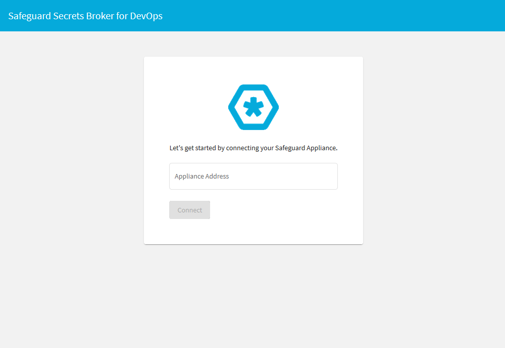
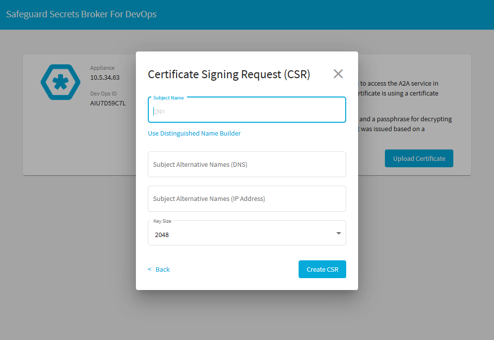
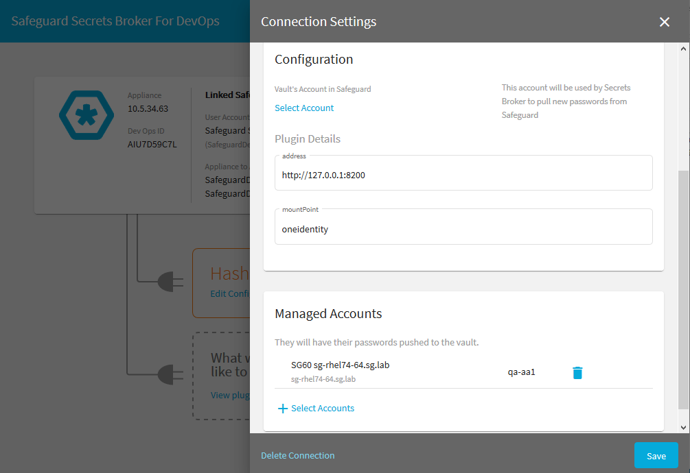
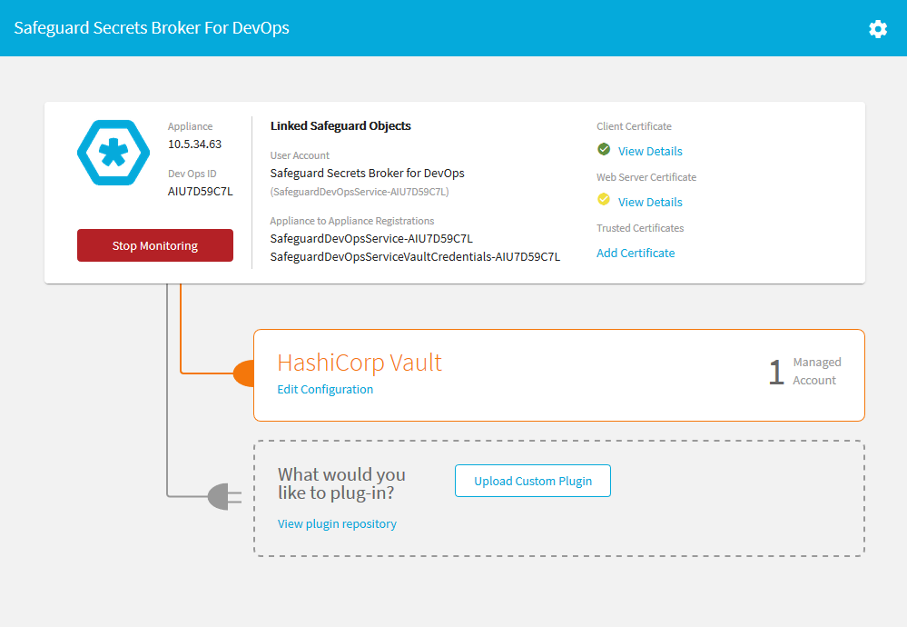
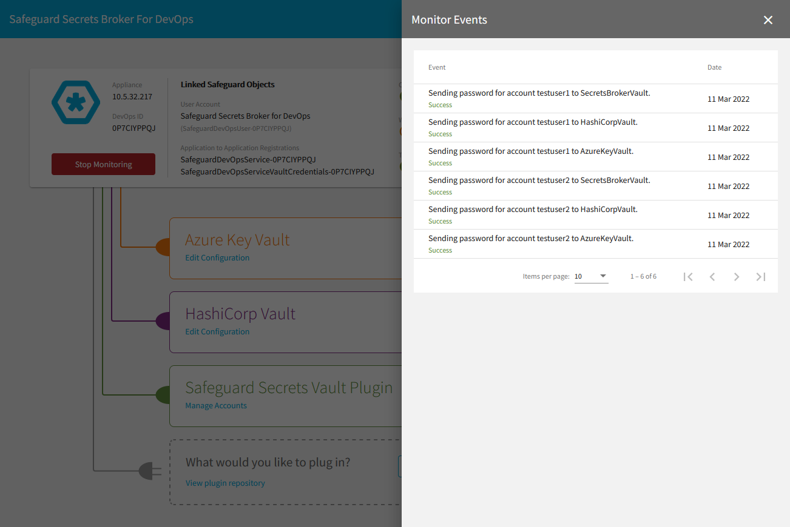
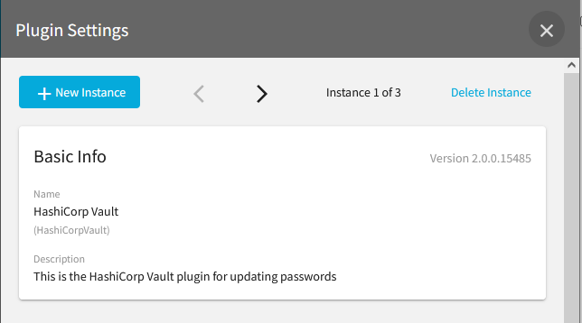
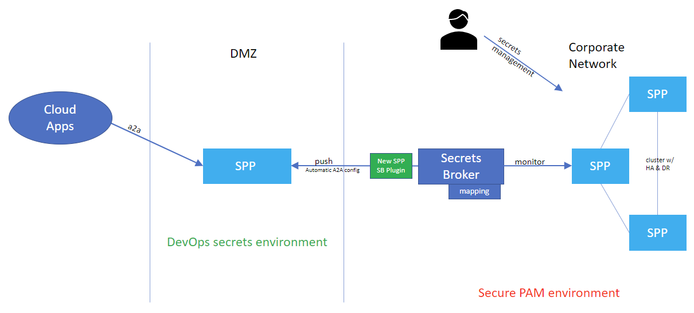

[](https://github.com/OneIdentity/SafeguardDevOpsService/releases/)
[](https://hub.docker.com/r/oneidentity/safeguard-devops/)
[](https://github.com/OneIdentity/SafeguardDevOpsService/blob/master/LICENSE)

## [Note]

* There has been a major library upgrade to the Azure Key Vault plugin version 2.x which will break the configuration for previous versions of the plugin. To fix the Azure Key Vault plugin after upgrading, edit the plugin configuration and add the TenantId/DirectoryId of the key vault. Once the configuration has been updated, the Azure Key Vault plugin should continue to work as expected.

* Due to an upgraded version of the SignalR technology in Safeguard for Privileged Passwords, a matching SignalR client version had to be upgraded in the Safeguard Secrets Broker for DevOps.  The upgraded SignalR technology that is used to monitor the password change events, is not backwards compatible with previous versions.  Therefore, version 1.5.0 and above of the Safeguard Secrets Broker for DevOps is only compatible with Safeguard for Privileged Passwords 6.8.0 and above.  The Safeguard Secrets Broker for DevOps 1.0.0 must be used with versions of Safeguard for Privileged Passwords 6.7.0 or below.

# Safeguard Secrets Broker for DevOps

The term DevOps can mean different things to different people.  It is important to make sure that we understand what we mean when we say we need help securing DevOps.

DevOps is any form of automation used between software development teams and operations teams to build, test, and release software with speed and resilience.  Most often, people think of DevOps in the context of automating the deployment of a SaaS solution to a cloud environment. However, DevOps can also be as simple as a source code repository hook that triggers a build server to check out and build a .NET library and push it to a NuGet server.

## Support

One Identity open source projects are supported through [One Identity GitHub issues](https://github.com/OneIdentity/SafeguardDevOpsService/issues) and the [One Identity Community](https://www.oneidentity.com/community/). This includes all scripts, plugins, SDKs, modules, code snippets or other solutions. For assistance with any One Identity GitHub project, please raise a new Issue on the [One Identity GitHub project](https://github.com/OneIdentity/SafeguardDevOpsService/issues) page. You may also visit the [One Identity Community](https://www.oneidentity.com/community/) to ask questions.  Requests for assistance made through official One Identity Support will be referred back to GitHub and the One Identity Community forums where those requests can benefit all users.

## Challenges

The following are security challenges of DevOps technologies:

* Source code security -- secrets used to pull code from a source code repository.
* Build system security -- secrets used to access storage and other resources for sensitive components, code-signing operations, etc.
* Package/image repository security -- secrets used to push build artifacts (packages and images) to repositories as well as pulling artifacts from those repositories.
* Securely deploying to infrastructure -- virtual machine root passwords, cloud privileged accounts, privileged accounts in orchestration frameworks, etc.
* Secure microservice communication -- inter-process or service to service communications--these can be passwords, API keys, PKI, etc.
* Secure persistence -- secrets used for persistence technologies: database passwords, s3 buckets, etc.

All of the security problems listed above involve restricting access to resources.  Access control requires authentication.  It is impossible to make an access control decision unless the system granting access to the resource can identify the requester, or at least know whether the requester can be trusted.  This process of authentication / access control is accomplished through secrets.  Possession of a secret authenticates the requester as trusted.  A secret could be a password, a private key, an API key, etc.

Authentication via possession of a secret becomes more complicated with DevOps because the requester is always an automated process rather than a human being.  Speed is also important in DevOps scenarios.  The immediate needs of DevOps automation cannot wait for a manual approval process (with the notable exception of release gating) as is common with traditional PAM in order to obtain a secret to authenticate.

The easiest way to automate a DevOps process is to use static embedded secrets.  However, security and compliance would dictate that secrets need to be stored securely and periodically rotated.  The secret needs to be securely delivered to the automated process that needs it, whether that be a build system, an orchestrator, a script, or whatever automated process.

In addition to these problems there is just a certain amount of fear that developers are not doing the right thing with DevOps.  There aren't easy ways to attest that developers aren't embedding secrets into code, or configuration files, or virtual machines.  The IT organization feels like DevOps is an opportunity for shadow IT to creep into their environment.

# Solution

The Safeguard recommended practice is to keep the less secure DevOps environment completely separate from the PAM environment with ZERO ACCESS to the PAM environment.  Instead, we will develop a solution for Safeguard "to push the secret to DevOps":

* Push means there is no access from DevOps to PAM:
  * No need for a bootstrap secret with access to PAM.
  * No need even for firewall access to PAM.
* Push is more efficient
  * The secret is only updated when it actually changes.
  * There is no need to continuously poll for a secret.


## Component Description

**Safeguard API** -- Safeguard has the A2A (Application to Application) REST API and the Core REST API (labeled Config in the diagram) that is used to configure the A2A service as well as other Safeguard services.  There are also open source SDKs for accessing these APIs from a .NET Standard 2.0 library.

* Discover -- A2A registrations are visible to certificate users via the core API.
* Monitor -- The A2A API includes a SignalR web socket connection that will give real-time updates for when passwords change (no polling).
* Retrieve -- Pull the secret password from the A2A API in a single HTTPS round trip.

**Safeguard Secrets Broker for DevOps** -- An open source component that can be deployed as a service or as a container in a customer environment and includes plugins that can be added to communicate with various DevOps technologies.  This service discovers A2A secrets that are configured to be pushed to different DevOps secrets solutions.

**Safeguard Secrets Broker for DevOps Config Utility** -- Single page web application designed to bootstrap the authentication between Safeguard Secrets Broker for DevOps and Safeguard.

**PARCache** -- This is a new PARCache service written for Safeguard customers transitioning from TPAM.

[](https://www.youtube.com/watch?v=vwHu7gYnEvo)

## Safeguard Secrets Broker for DevOps Technologies Plugins

* HashiCorp Vault
* Azure Key Vault
* Kubernetes Secrets Storage
* Jenkins Secrets
* AWS Secrets Manager Vault
* CircleCI Secrets
* Safeguard to Safeguard Secrets
* GitHub Vault
* ...

## Multiple Plugin Instances

One of the limitions of Safeguard Secrets Broker for DevOps was that only one type of vault or vault plugin, could by configured and used to push credentials to that vault. In the latest releases of Secrets Broker, that limitation no longer exists. Secrets Broker has been enhanced to allow multilple instances of any plugin.

Some of the advantages of having multiple plugin instances is that now Secrets Broker can be configured to push credentials to more than one instance of a given type of vault or to push credentials to different repositories within the same type of vault. Multiple plugin instances was also necessary in order to push different types of credentials other than just passwords and to support reversing the flow of credentials back into Safeguard from a third party vault. Multiple instances can be created for any plugin and there is no limit to the number of instances of a plugin.

## Passwords, SSH Keys and API Keys

One of the newer features of Safeguard Secrets Broker for DevOps is support for SSH keys and API keys. Secrets Broker has always had the ability to pull password from Safeguard and push them to a variety of third party vaults. Now Secrets Broker can also push SSH keys and API keys to third party vaults that support those types of credentials.

Each Secrets Broker plugin indicates which types of credentials it is able to handle. As part of the plugin configuration, a supported credential type can be selected for each instance of a plugin. Once a credential type has been selected for the plugin instance, the plugin instance will pull the credential type for all of it's registered accounts and push the credentials to the third party vault. Each plugin instance can be configured to handle a single credential type.

## Reverse Flow, Secrets Backup and Distribution

Beginning with Safeguard Secrets Broker for DevOps 7.1.0, Secrets Broker has the ability to not only push credentials from Safeguard out to third party vaults, it also has the ability to pull credential change back into Safeguard. This feature is call Reverse Flow.

Each plugin instance can be designated as Reverse Flow or Normal Flow. All other configuration parameters remain the same for the plugin instance. If a plugin instance has been designated as Reverse Flow, it will be responsible for retrieving the credentials from the third party vault for all of the accounts that have been registered for the plugin instance. Once a credential has been retrieved, it will be evaluated to determine if the credential has changed and if so, the new credential will be pushed back Safeguard and stored for the registered account. In addition, a password changed event will be sent back to Secrets Broker to allow any other plugin instances that is interested in the same credential, to pull the new credential and push it to it's vault.

With the ability designate a plugin instance as Reverse Flow, Secrets Broker introduces several advantages to credential management.

* Any credential respository within a third party vault can be designated as the credential source.
* Any third party credential can be mapped back to a Safeguard asset and account which allows it to be managed by Safeguard.
* Safeguard will be the backing credential store for third party credentials which allows any credential be to be restored or managed by workflow.
* Secrets Broker can be used to synchronize credentials between different third party vaults.
* By using Secrets Broker to push and pull credentials, a hybred devops environment can be created and maintained which includes all of the security and credential management of Safeguard for Privileged Passwords.

## Safeguard for Privileged Passwords Setup

1. Navigate to Settings->Appliance->Enable or Disable Services and enable the A2A service.
1. Add an asset and account (including a service account).
1. Set a password on the account.
1. Create an AssetAccount for each third party vault that will be used by Safeguard Secrets Broker for DevOps.  The account should contain the vault credential that will be used to authenticate to the vault itself.  This account will be used as part of the configuration of the third party vault plugin.
1. Optional: Create a new certificate with a private key (PFX format) that will be assigned to the certificate user.  The public certificate will be uploaded into SPP as a trusted certificate along with any other issuer certificates that may be part of the certificate chain.  The certificate and private key will be uploaded into Safeguard Secrets Broker for DevOps during configuration and be used to create a new certificate user and A2A registration.  This certificate can be created independent of Safeguard Secrets Broker for DevOps or from a CSR that is created by Safeguard Secrets Broker for DevOps.  (See Configuring Safeguard Secrets Broker for DevOps)

## Safeguard Secrets Broker for DevOps Setup

### From Source

1. Checkout and load the SafeguardDevOpsService project solution in Visual Studio. (<https://github.com/OneIdentity/SafeguardDevOpsService>)
1. Rebuild all (Rebuild Solution) the SafeguardDevOpsService.
1. Start the SafeguardDevOpsService.
1. In a browser navigate to <https://localhost/service/devops/swagger/index.html>
1. To build an installer MSI package, in the SafeguardDevOpsService Visual Studio solution, right-click on the SetupSafeguardDevOpsService project and select "Build".

### From Installer

1. Copy the installer MSI package to the local file system of a Windows 10 or Windows Server 2016 or better, computer.
1. Open a PowerShell command window as an administrator and invoke the above MSI installer package.
1. Follow all prompts - This will deploy the package and automatically start it as a Windows service.
1. At start up, Safeguard Secrets Broker for DevOps will create a new folder under the ```/ProgramData``` directory as ```/SafeguardDevOpsService```.  This folder will contain the log file, database and the external plugins folder.  The external plugins folder will be initially empty (See Deploying Vault Plugins).
1. Make sure that the firewall on the Windows computer has an inbound rule for allowing https port 443.
1. Acquire a valid login token to SPP.  Use the Powershell cmdlet (See <https://github.com/OneIdentity/safeguard-ps>):

```powershell
    Connect-Safeguard insecure <spp-ip-address> local <user-with-admin-permissions> -NoSessionVariable
```

7. In a browser navigate to `<https://<your-server-ip>/service/devops/swagger/index.html>`
1. Click on the ```Authorize``` button on the upper left-hand side of the Safeguard Secrets Broker for DevOps swagger page.
Enter `spp-token <paste token>` as the value and click the ```Authorize``` button and then the ```Close``` button
    - At this point the swagger page has a login token that will be used in every call made to the Safeguard Secrets Broker for DevOps API.
1. Navigate to and call: `PUT /service/devops/Safeguard`

```json
    {
    "NetworkAddress": "<your SPP appliance>",
    "ApiVersion": 4,
    "IgnoreSsl": true
    }
```

10. This endpoint will check the connectivity to the SPP appliance and fetch and store the token signing certificate.
    * It is also a little unique in that the call must contain a valid authorization token just like all other calls, but it can be called before the user actually logs into the Safeguard Secrets Broker for DevOps.  The user authorization will still be validated but it is a one-time validation just to make sure that the user is authorized to setup the SPP network information.
1. Navigate to and call: `GET /service/devops/Safeguard/Logon`
    * At this point the swagger page is logged into the Safeguard Secrets Broker for DevOps and will remain logged in until the page is refreshed, closed or `POST /service/devops/Safeguard/Logoff` is called.

### From Docker Image

A Docker image for Safeguard Secrets Broker for Devops is built and made available on dockerhub as oneidentity/safeguard-devops (<https://hub.docker.com/r/oneidentity/safeguard-devops>). This image can be downloaded and deployed on a Linux system.

1. The following command will download and deploy the docker image of the Secrets Broker.

    ```Command
    $ docker run -it -p 443:4443 --env DOCKER_HOST_IP=<hostIp> --cap-add NET_ADMIN oneidentity/safeguard-devops
    ```

    The safeguard-devops docker image binds the server to port 4443 internally. The -p 443:4443 parameter maps the internal port to 443 externally. To map the internal port to a different external port, replace the value 443 with externally available port.

    The --env DOCKER_HOST_IP=\<hostIp\> must be set to the IP address of the docker host computer. If omitted, the Safeguard Secrets Broker for Devops will be unable to accurately apply the IP restrictions to the A2A registrations in Safeguard.

    The --cap-add NET_ADMIN parameter is necessary if the internal port is being mapped to an external privileged port (port less than 1024).

1. There are certain environment variables that can be set at the time the docker image deployed to control the debug level and database encryption. For security reasons, these environment variables should be provided to the docker environment using a heredoc to create an ephemeral file. The following is an example of how to set the environment variables.

    ```Command
    $ docker run -it -p 443:4443 --cap-add NET_ADMIN --env-file <(cat <<EOF
      DOCKER_HOST_IP=<hostIp>
      SSBEncPasswd=thisisapasswordformyencrypteddatabase
      EOF
      ) oneidentity/safeguard-devops
    ```

1. To update the docker image

    ```Command
    $ docker pull oneidentity/safeguard-devops
    ```

WARNING: In some docker environments, the container may not be able to determine the host IP address. This can result in an A2A registration IP restriction that does not match the host and may prevent the password monitor from starting. The recommended way to fix this issue is to set the DOCKER_HOST_IP environment variable to the IP address of the docker host computer.

### Environment Variables

Initialization of the Secrets Broker on Windows or as a Docker image can be controled by specifying certain environment variables. These environment variables can be passed nto the initializtion of the Secrets Broker in one of two ways depending on the operating system. For Windows, the environment variables are set through a file called 'appsettings.json'. To change the variables on windows, navigate to the installed location of the Secrets Broker and rename the '_appsettings.json' to 'appsettings.json'. Then edit the settings file and change the corresponding variable. To change the variables in a Docker environment, the variables need to be set on the command line and passed into the image. The following describes the available environment variables:

* DOCKER_HOST_IP - This environment variable should always be included when starting the Safeguard Secrets Broker for Devops in a docker container. It should be set to the IP address of the docker host computer.
* LogLevel - Information(Default for Windows), Debug(Default for Docker), Error, Warning, Fatal and Verbose
* SSBEncPasswd - The encryption password for encrypting the Secrets Broker database on disk. This is only available for docker. The Windows database is always encrypted.
* Port - Secrets Broker listen port. The docker environment should be left at the default of 4443. The windows port can be changed by updating the appsettings.json file.

## Configuring Safeguard Secrets Broker for DevOps

### Using the Web User Interface

1. Once the Secrets Broker has been install and the service as been started as decribed above, in a browser navigate to the root URI of the service. `https://<service IP address or DNS>`
2. The Secrets Broker will request the IP address or Host Name of the Safeguard appliance that the Secrets Broker should use.



3. The Secrets Broker will redirect to the Safeguard login page and allow the user to login in the same way as for Safeguard itself.
1. After the user has authenticated with Safeguard, the Secrets Broker will display the main page.
1. At this point the user must either upload a new client certificate or create a CSR and have it signed by a trusted signing authority.



6. After uploading the client certificate, the Secrets Broker will complete the configuration of the service which involves adding two A2A registrations to the associates Safeguard appliance and adding a certificate user.
1. The next step is to upload one or more plugins which will allow the Secrets Broker to push passwords to a third party vault. Follow the link to the Github repository for downloading available plugins. After downloading a plugin from the Github project, upload a plugin into the Secrets Broker.
1. After a plugin has been uploaded, it will appear on the main page and allow the user to configure it. Each plugin has a unique configuration. Click on the 'Edit Configration' button to finishing configuring the plugin.
1. Each plugin must also be associated with 1 or more accounts. These accounts represent the accounts for which the Secrets Broker will pull passwords from the Safeguard Appliance and push them to the corresponding third party vault.



10. After all plugins have been installed, configured and include mapped accounts, the user can start the monitoring process by clicking on the 'Start Monitor' button.  The Secrets Broker will listen for a changed password event for any of the mapped accounts and automatically pull the passwords for those accounts and push the passwords to their respective third party vaults.



### Monitoring Password Events and Trouble Shooting

The Safeguard Secrets Broker for DevOps provides ways to monitor the password events and trouble shooting.  This funcitonality can be found under the system menu.  To access the system menu, select the cog icon in the upper right-hand corner of the browser window.  The system menu contains several options such as restarting the Safeguard Secrets Broker for DevOps, deleting the current configuration which resets the system to the default state as well as downloading the system log and viewing the password event history.

* To trouble shoot issues that may arise, select the Download Log option from the System Menu.  The system log will provide details about a system issue or error that may have occured.
* To view the password events, select the View Monitor Event History option from the System Menu.  The Monitor Events will appear which contains a list of the password events that have taken place since the system was last started.  These events are only stored in memory which means that each time that the Safeguard Secrets Broker for DevOps is restarted, the list will be cleared.



### Configuring Multiple Plugin Instances

Multiple instances of any plugin can be created after a plugin has been installed. Creating additional instances of a plugin provides the ability to push and pull credentials using various configurations of the same plugin. These configuration can include different types of credentials, normal flow or reverse flow for the same plugin.

At the time when a plugin is installed, an initial instance of the plugin is created. This initial instance can be configured in anyway that is needed. If additional configurations are required, a new instance of the same plugin can be created by clicking on the ```New Instance``` button at the top of the ```Plugin Settings``` page. After creating a new instance, a dialog will be shown to confirm that a new instance of the plugin should be created and asking if Secrets Broker should copy the configuration of the current instance. After confirming the new instance, Secrets Broker will allow the new instance to be configured. Each plugin instance is configured independently of any other instance. All plugin instances of the same type share the same plugin code but they each have their own unique name and configuration.



Just below the ```Plugin Settings``` banner, Secrets Broker shows the number of existing instances for the plugin, provides previous and next buttons to scroll through the plugin instances and provides a ```Delete Instance``` button to delete the current instance of a plugin. Any instance, including the initial instance, of a plugin can be deleted. If all instances are deleted, then the plugin itself will be deleted. Another option for deleting all instances of a plugin as well as the plugin itself, is to click on the ```Delete Plugin``` button at the bottom of the ```Plugin Settings``` page.

### Reverse Flow

Configuring a Secrets Broker plugin instance as Reverse Flow is done by simply checking the ```Reverse Flow``` checkbox in the ```Configuration``` section of the ```Plugin Settings``` page. This causes Secrets Broker to call the plugin instance when a registered account credentials needs to be fetched rather than pushed.


#### - Reverse Flow Monitor

Secrets Broker implements a Reverse Flow background thread that polls each Reverse Flow designated plugin instances on a default 60 second cycle. Once called, each Reverse Flow plugin instance queries the configured third party vault for the credentials that belong to the accounts that are registered for the plugin instance. Each credential that is retrieved is evaluated by Secrets Broker to determine if it changed before attempting to push the credential back to Safeguard. Unlike the credential push processing which relies on a SignalR change event, the polling process for Reverse Flow is not as responsive as the credential push process. The polling interval for the Reverse Flow background thread can be adjusted using the REST API

```PUT /service/devops/v2/Monitor/ReverseFlow```

See the REST API swagger page for more details. This API provides an alternate way to start and stop the Reverse Flow background thread independently of the A2A monitoring and also to adjust the polling interval of the background thread.

#### - Third Party Vault Account Mapping

One of the features of Secrets Broker is that every registered account of a plugin instance can have an alternate account name. When pushing credentials to a third party vault, the credential is saved as the alternate name that is assigned to it. When the plugin instance is designated as ```Reverse Flow```, the alternate account name is used to map the third party vault account name back to a managed account in Safeguard. By using the alternate account name to map third party vault accounts to Safeguard account, Secrets Broker makes it easy to manage credentials which may not already exist in Safeguard.

#### - Synchronizing Credentials Among Different Vaults

Secrets Broker has always had way to push the same credentials to multiple third party vaults as the same account with Safeguard being the source of the credential. The ```Reverse Flow``` feature now provides a way for a third party vault to be the source of a credential with Safeguard being the backup source. Designating a plugin instance as ```Reverse Flow``` makes the third party vault associated with the plugin ilnstance, the source of any registered account credential. Whenever the credential changes in the third party vault, the change is reflected in Safeguard and pushed to any other third party vault that should be synchronized with the source. This guarantees that all of the credential vaults that need a specific credential, have the same credential as every other vault. Even if one third party vault doesn't support credential rotation, for example, a credential can be rotated and the synchroized by a third party vault that does support rotation or by Safeguard itself. Secrets Broker allows the strengths of one vault to be shared by others.

### Backup and Restore

Secrets Broker now provides a way to backup and restore the database and plugin configuration. Two new menu entries have been added to the ```Settings``` menu which instruct Secrets Broker to create and download a backup bundle. The backup bundle has the option to be encryted with password if security is a concern. At the time when a backup is restored, if the backup requires a password, Secrets Broker prompt for the password, decrypt the backup and restore the database and configuration to the previous state.

### Safeguard-to-Safeguard plugin

Along with several other plugins that have been recently added to Secrets Broker, the Safeguard-to-Safeguard plugin provides a unique opportunity to take advantage of everything Safeguard has to offer in a public facing way. Many companies have a need to make some credentials available to users or applications that exist outside their firewall. However, nobody wants to expose all of their corporate secrets to the world even if those secrets are stored inside of a secure vault like Safeguard. The solution to this problem is to place only the secrets outside of the firewall that are required and then rotate those secrets frequently.

Secrets Broker along with the Safeguard-to-Safeguard plugin, allows an environment to be configured that includes a standalone instance of Safeguard placed in the DMZ, that only contains the required accounts and credentials. All of those accounts are still managed and rotated by the corporate Safeguard cluster but the Safeguard cluster and the standalone instance of Safeguard have no direct connection to each other. In this case, Secrets Broker provides a loose connection by only pulling the registered accounts, scrubbing out all proprietary information and pushing the account to the standalone Safeguard appliance. The corporate Safeguard Cluster is still managing everything about the registered accounts and rotating the credentials as required. The standalone Safeguard appliance still requires that all credentials are released through a strict policy that conforms to a workflow and audited.



### Using the REST API

1. There are two different certificates that Safeguard Secrets Broker for DevOps needs in order to function properly.
    * The first certificate is the web service SSL certificate.  A default self-signed SSL certificate was create when Safeguard Secrets Broker for DevOps was launched for the first time.  This certificate can be replaced with your own server authentication SSL certificate if desired.  This is optional.
    * The second certificate is a client authentication certificate which will be used to create the SPP certificate user and A2A registration.
    * Both of these certificates with their corresponding private keys can be generated outside of Safeguard Secrets Broker for DevOps and uploaded in PFX format or Safeguard Secrets Broker for DevOps can generate a private key and CSR which can be signed and uploaded.
1. Install a client certificate and private key - Since the web service SSL certificate is optional, only the steps for creating the client certificate will be described here.  A similar procedure can be used to generate and upload the web service SSL certificate.
    * Navigate to and call: `GET /service/devops/Safeguard/CSR` with the certificate type `A2AClient`.  An optional certificate size and subject name can be provided.
    * Sign the CSR to produce a public certificate.
      * KeyUsage - DigitalSignature, KeyEncipherment.
      * ExtendedKeyUsage - ClientAuth.
    * Navigate to and call the `POST /service/devops/Safeguard/ClientCertificate` with the JSON body.

    ```json
    {
      "Base64CertificateData" : "<string>",
      "Passphrase" : "<string>" - Only if uploading a PFX with a private key otherwise omit
    }
    ```

    * Navigate to and call: `POST /service/devops/Safeguard/Configuration` with an empty body  `{}`
      * Optionally the client certificate can be uploaded as part of configuring Safeguard Secrets Broker for DevOps in this call, by passing the same body as above.
      * This call will store the client certificate and private key in Safeguard Secrets Broker for DevOps database, create a new DevOpsService User in SPP with the appropriate permissions, create a two new A2A registrations with the appropriate IP restrictions and prepare both Safeguard Secrets Broker for DevOps and SPP to start pulling passwords.
1. Configure Safeguard Secrets Broker for DevOps listen port and log level.
    * An example appsettings.json file was copied to the ProgramFiles\SafeguardDevOpsService folder during installation.  The example settings file will be prepended with an '_'.  To configure the listen port or the log level, rename this file by removing the preceding '_' so that the file name is 'appsettings.json'.  Then open the settings file in a text editor. The editor must be run as the administrator user.
      * The appsettings.json file has two configuration settings:
        * "HttpPort": `"<port>"` - The value of this entry defines the listen port that Safeguard Secrets Broker for DevOps will listen to.
        * "LogLevel": `"<level>"` - The log level defaults to "Information". However the level can be set to "Information", "Error", "Fatal", "Verbose", "Warning" or "Debug".
      * After making any changes to the appsettings.json settings file, Safeguard Secrets Broker for DevOps must be restarted in order for the changes to take effect.

## Installing Vault Plugins

1. Copy one or more plugin zip files to the Windows local file system.
1. Navigate to and call: `POST /service/devops/Plugins/File` to upload the plugin zip file.
    * Safeguard Secrets Broker for DevOps will automatically detect, load and register each plugin.
1. Navigate to and call: `GET /service/devops/Plugins` to verify that the plugin(s) were deployed and registered in Safeguard Secrets Broker for DevOps.
1. Since each plugin has its own unique configuration, each one must be configured individually.
    * Navigate to and call: `PUT /service/devops/Plugins/{name}` with the appropriate body to configure the plugin.
    * The appropriate body can be copy and pasted from the corresponding JSON that is returned from `GET /service/devops/Plugins/{name}`. The PUT API for configuring the plugin will only recognize the entries under the "Configuration" tag even though the body will accept the entire plugin JSON body. For example, the following can be used to configure the HashiCorp Vault plugin:

    ```json
    {
      "Configuration":
      {
        "address":"<hasicorp-url>",
        "mountPoint":"secret",
      }
    }
    ```

## Configuring and Mapping Accounts to the Vault Plugins

1. Navigate to and call: `GET /service/devops/Safeguard/AvailableAccounts`
    * This call will produce a list of all of the available accounts in SPP that can be requested.
    * Copy and paste the desired contents of this call to the following API for adding retrievable accounts.
1. Navigate to and call: `POST /service/Devops/Safeguard/A2ARegistration/RetrievableAccounts`
    * The body of this call should be copied and pasted from the previous results.  The body can be edited to remove any account data that should not be include in the A2A retrievable accounts.
    * Copy the results of this call into the following API for mapping accounts to plugins.
1. Navigate to and call: `POST /service/devops/Plugins/{name}/Accounts`
    * The body of this call should be copied and pasted from the previous results.  The body can be edited to remove any account data that should not be used to pull a password and send it to the vault plugin.
    * Repeat the above call for each plugin which needs to be configured for pulling account passwords.

## Configuring the Vault Credential Account for the Plugins

1. Navigate to and call: `GET /service/devops/Safeguard/AvailableAccounts`
    * This call will produce a list of all of the available accounts in SPP that can be requested.
    * Copy and paste the Asset-Account that corresponds to the third party vault, to the following API for adding a vault account.
1. Navigate to and call: `POST /service/devops/Plugins/{name}/VaultAccount`
    * The body of this call should be copied and pasted from the previous results.  It should be just the account information that corresponds to the third party vault.
    * Repeat the above call for each plugin that needs to be configured for pulling the vault credential.

## Start Safeguard Secrets Broker for DevOps Password Monitoring

1. Navigate to and call POST /service/devops/Monitor

    ```json
    {
      "ReverseFlowMonitorState": {
        "Enabled": false,
        "ReverseFlowPollingInterval": 60
      },
      "Enabled": false
    }
    ```

1. The same API can be used to stop password monitoring.
1. At this point Safeguard Secrets Broker for DevOps will detect whenever a password changes in SPP, pull the password and push it to the appropriate plugin(s).  The custom code in the plugin(s) will push the password to the third party vault.

## Developing Custom Plugins for Safeguard Secrets Broker for DevOps

An external plugin is a simple intermediary between the Safeguard Secrets Broker and a third party vault or any technology that stores secrets. Building an external plugin requires the plugin developer to implement a predefined plugin template with the specific functionality for communicating with the third party vault. The Safeguard Secrets Broker for DevOps project provides working plugins as well as a simple example plugin that can be used as a reference for building a new plugin. To get started building a custom Safeguard Secrets Broker plugin, go to the ExternalPlugins page of the project at `https://github.com/OneIdentity/SafeguardDevOpsService/tree/master/ExternalPlugins`
